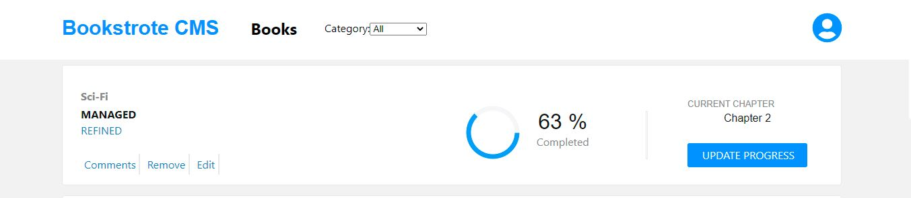
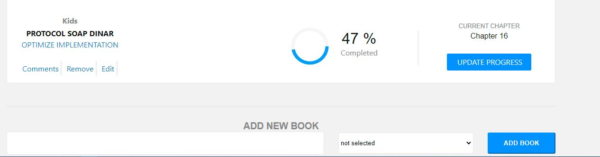

# REACT Redux Bookstore  APP
### About
A frontend application for bookstore CMS which is build by using React and Redux.

  

## ScreenShot
## Screenshot
 </br>



## Live Demo 

[Clic here](https://bookstoreappbillo.herokuapp.com/)
## Built With

## Milestones of the project.

- [x] Miltestone 1 - Basic project structure
  - Import necessary libraries and remove unnecessary files.
- [x] Miltestone 2 - Components and Redux store are implemented. The following tasks are done:
  - Prepare the directory structure
  - Implement the `App` component
  - Implement the `BooksList` component
  - Implement the `Book` component
  - Implement the `BooksForm` component
  - Define the Redux actions and reducers
  - Initialize the Redux store
  - Create fake books with the help of [faker](https://www.npmjs.com/package/faker) library.
  - Introduce `mapStateToProps` to reach the state as a props in container components.
- [x] Miltestone 3 - Interactive form is created and configured. The following tasks are done:
  - Make the `BooksForm` component stateful.
  - Connect the `CREATE_BOOK` action to the component.
  - Connect the `REMOVE_BOOK` action to the component.
- [x] Miltestone 4 - Category filter is implemented. The following tasks are done:
  - Add a new presentational component `CategoryFilter` which is a simple select box.
  - Enhance the Redux store to keep information about the current books filter.
  - Create a new Redux action `CHANGE_FILTER` and a `filter.js` reducer which modifier filter in Redux store.
  - Implement the `CategoryFilter` component which renders a select box with filter categories.
  - Render the `CategoryFilter` component in the `BooksList` component.
  - Implement the `handleFilterChange` method which modifies the filter state in the Redux store and it is passed down as a prop to CategoryFilter.
  - Implemented a conditional method which decides which books should be shown in the table depending on the filter value from Redux store.
- [x] Miltestone 5 - [The specific UI](https://app.zeplin.io/project/5b35a9e13227086040f8eb75/screen/5b695e29bb8c844f118f9378) design is implemented and the following tasks are done:
  - Added style classes for the `BooksList` component.
  - Added style classes for the `BooksForm` component.
  - [Recharts](https://github.com/recharts/recharts) library is used to visualize the percentage with piechart.
  - The design is implemented with Pure CSS with Flexbox, none of the extra ui library like Bootstrap is used.

## Built With

- [Node.js]
- [npm](https://www.npmjs.com/)
- [ES6](http://es6-features.org/) 
- [React](https://reactjs.org/)
- [React-DOM](https://reactjs.org/docs/react-dom.html)
- [create-react-app](https://github.com/facebook/create-react-app)
- [React-Redux](https://github.com/reduxjs/react-redux)
- [Redux](https://github.com/reduxjs/redux)
- [PropTypes](https://www.npmjs.com/package/prop-types)
- CSS
- Heroku
- ESLint
- StyleLint
- [Recharts](https://github.com/recharts/recharts)
- [react-icons](https://www.npmjs.com/package/react-icons)


## Packages
- [PropTypes](https://www.npmjs.com/package/prop-types)

## Prerequisities

To get this project up and running locally, you must follow the steps from the [getting started section](#getting-started).

## Getting Started

**To get this project set up on your local machine, follow these simple steps:**

**Step 1**<br>
Navigate through the local folder where you want to clone the repository and run<br>
git clone ` https://github.com/billodiallo/bookstore.git`. It will clone the repo to your local folder.<br>

**Step 2**<br>
- Cd inside the project

- run npm install

### Run project 

`` npm run start ``

open ```localhost:3000``` in browser. 


## 🤝 contributing

Contributions, issues and feature requests are welcome!

## Author

👤 Billo Dallio

- GitHub: [@billodiallo](https://github.com/billodiallo)
- Twitter: [@BilloDi83547008](https://twitter.com/BilloDi83547008)
- LinkedIn: [Billo Diallo](https://www.linkedin.com/in/mabillodiallo/)

## 🙋‍♂ show your support

give a ⭐️ if you like this project!

## 📝 license


This project is [MIT](LICENSE) licensed.

